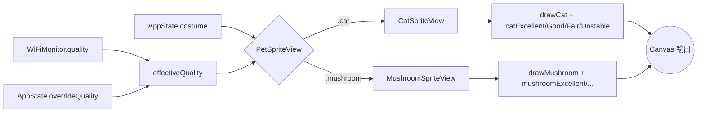

# ADR 0004: Sprite 以純程式碼定義，並用造型分派系統擴充

- Status: Accepted
- Date: 2026-07-22

wifi-mob 不帶圖片素材，所有角色 sprite 都用 `[[Int]]` 與 palette 直接寫在程式裡，再由 `PetSpriteView` 依造型分派。

## Context

專案想要的是低成本、可攜、可直接改造的 pixel-art 角色，而不是完整美術管線。若用 PNG 或 asset catalog，雖然初期直覺，但會把專案帶向資源管理、bundle 載入與版本同步問題；對只有幾種品質狀態、幾套 16x14 左右圖格的工具來說，這些額外機制不值得。現有實作已在 `PixelScene.swift` 以 `catExcellent`、`catGood` 等 grid 描述品質態，再由 `drawCat` 負責繪製；`MushroomSprite.swift` 則提供 `drawMushroom`。同時 `AppState.costume` 與 `AppState.overrideQuality` 已定義出切換造型與測試狀態的入口，適合繼續沿用。

## Decision

每種造型各自用 `[[Int]]` 定義 sprite grid，並提供對應 palette 與 free function 繪圖函式，例如 `drawCat`、`drawMushroom`。`PetSpriteView` 作為統一入口，依 `costume` 在 `CatSpriteView` 與 `MushroomSpriteView` 間分派；每個造型都維持四份品質對應 grid，讓 `Quality` 可以直接映射到視覺狀態。新增造型時遵循三步：新增 `Costume` enum case、加入 grid 與繪圖檔、補上 `PetSpriteView` 的 dispatch 分支。

## Consequences

- 好處：無外部圖片、字型或 asset catalog，單一 binary 即可分發，符合輕量目標。
- 好處：程式碼本身就是設計文件；讀 `drawCat`、palette 與 grid，就能知道各品質狀態的意圖。
- 好處：造型擴充路徑固定，`AppState.costume` 與 `PetSpriteView` 讓新角色加入成本可預期。
- 代價：sprite 設計靠手寫陣列，複雜圖形或細膩動畫會變得笨重且難校對。
- 代價：美術修改需要工程師直接碰程式碼，沒有獨立素材交付流程。

## Alternatives Considered

- PNG 素材：視覺製作自由度高，但需管理 Bundle Resources 與 asset catalog，違反最小分發目標。
- SF Symbols：整合輕鬆，但無法表達四種品質狀態與自訂角色風格。
- Metal shader：技術上可做更炫效果，但對此專案是明顯過度工程。
